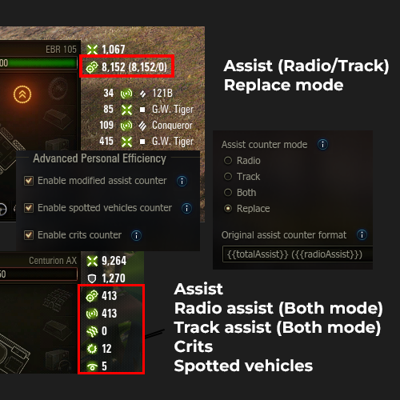

# Advanced Personal Efficiency

This mod enhances the default damage log panel by adding new efficiency counters (such as spot count and crits) and provides additional features like separate radio and track assist counters. It also allows customization of the assist counter value in the garage mod settings.

  

