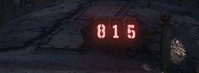
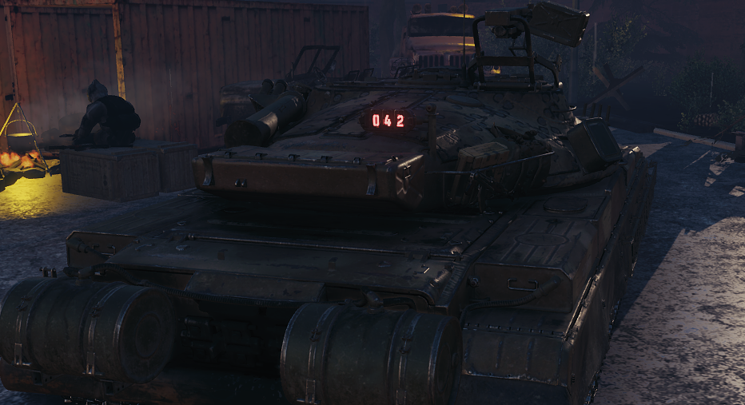
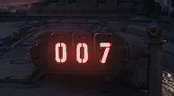

# Serial Number Changer

Mod replaces serial number on unique styles to one of modes:

- predefined value by user
- kill counter on that vehicle like StatTrak or BATTLESTAT in CS:GO or PUBG

## Screenshots

**Thanks [OldSkool](https://github.com/deadhat) and EngineExt for screenshots**

  <b>predefined value by user</b> 
   
  <b>Kill counter (i.e. StatTrak or BATTLESTAT)</b> 
   
  <b>predefined value by user</b> 
   
  <b>Kill counter (i.e. StatTrak or BATTLESTAT)</b> 
   

## Legals

CS:GO, Counter-Strike: Global Offensive, StatTrak and all related logos are trademarks of Valve Corporation or its affiliates.
PUBG, PLAYERUNKNOWN’S BATTLEGROUNDS, BATTLESTAT and all related logos are trademarks of PUBG Corporation or its affiliates.
